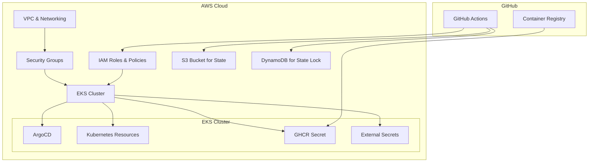
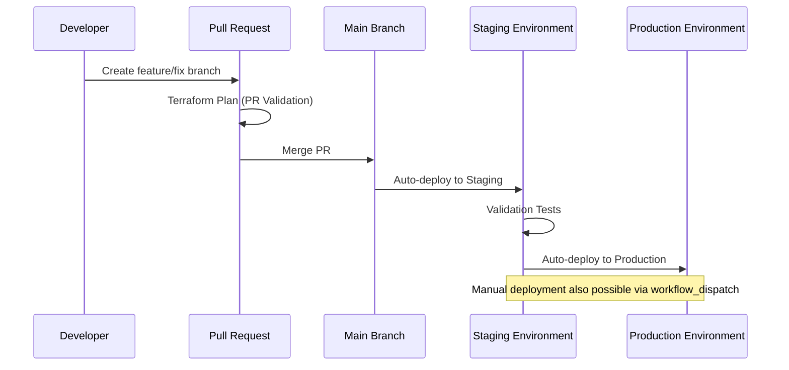
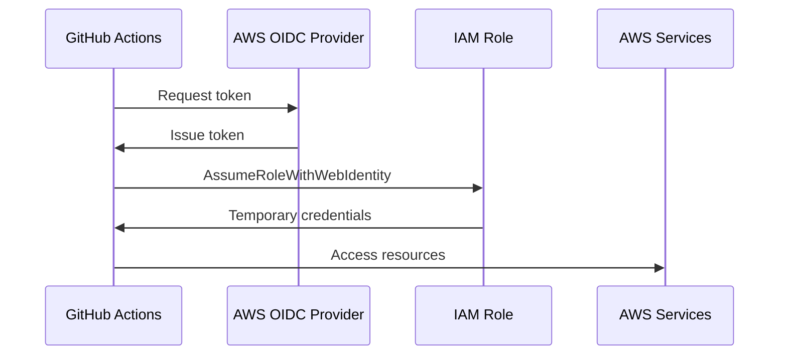

# FastAPI Project Infrastructure Deployment Documentation

## Overview

This document provides comprehensive documentation of the infrastructure deployment process for the FastAPI project. It covers the architecture, deployment workflows, key components, and troubleshooting steps.

## Table of Contents

1. [Infrastructure Architecture](#infrastructure-architecture)
2. [Deployment Workflow](#deployment-workflow)
3. [Key Components](#key-components)
4. [Terraform State Management](#terraform-state-management)
5. [GitHub Actions CI/CD](#github-actions-cicd)
6. [Troubleshooting Common Issues](#troubleshooting-common-issues)
7. [Recent Improvements](#recent-improvements)
8. [Best Practices](#best-practices)

## Infrastructure Architecture

The infrastructure is deployed on AWS and consists of the following components:



### Environment Separation

The infrastructure is deployed to two separate environments:

1. **Staging (stg)**: Used for pre-production testing
2. **Production (prod)**: Used for the live application

Each environment has its own dedicated resources and state files.

## Deployment Workflow

The deployment process follows a folder-based approach with a multi-stage workflow:



### Deployment Process

1. **PR Validation**: When a pull request is created, Terraform plans are generated for both staging and production environments.
2. **Staging Deployment**: When changes are merged to main, they are automatically deployed to the staging environment.
3. **Validation**: Automated tests verify the staging deployment.
4. **Production Deployment**: After successful validation, changes are automatically deployed to production.
5. **Manual Deployment**: Manual deployments can be triggered via GitHub Actions workflow_dispatch.

## Key Components

### Terraform Modules

The infrastructure is organized into reusable Terraform modules:

| Module | Description |
|--------|-------------|
| vpc | Networking infrastructure |
| security | Security groups and network policies |
| eks | Kubernetes cluster configuration |
| argo | ArgoCD installation and configuration |
| ghcr-secret | GitHub Container Registry authentication |
| external-secrets | External Secrets Operator for managing secrets |
| k8s-resources | Kubernetes resources like namespaces and service accounts |
| github-actions-oidc | OIDC authentication for GitHub Actions |

### Folder Structure

```
fastAPI-project-infra/
├── bootstrap/                # Bootstrap infrastructure
├── scripts/
│   ├── deployment/           # Deployment scripts
│   │   ├── deploy-with-target.sh  # Main deployment script
│   │   └── destroy-with-target.sh # Infrastructure destruction script
│   └── update-state.sh       # State management script
├── terraform/
│   ├── environments/
│   │   └── deploy/
│   │       ├── stg/          # Staging environment configuration
│   │       └── prod/         # Production environment configuration
│   └── modules/              # Reusable Terraform modules
└── .github/
    └── workflows/            # CI/CD workflows
```

## Terraform State Management

### State Storage

Terraform state is stored in an S3 bucket with the following structure:

```
s3://fastapi-project-terraform-state-{AWS_ACCOUNT_ID}/
└── fastapi/
    └── infra/
        ├── stg/
        │   └── terraform.tfstate
        └── prod/
            └── terraform.tfstate
```

### State Locking

DynamoDB tables are used for state locking:

- `terraform-state-lock`: Used for production environment
- `terraform-state-lock-dev`: Used for development environment
- `terraform-state-lock-test`: Used for testing

### State Backup

Before any operation that could modify the state, a backup is created:

```
s3://fastapi-project-terraform-state-{AWS_ACCOUNT_ID}/
└── fastapi/
    └── infra/
        └── prod/
            ├── terraform.tfstate
            ├── backups/
            │   └── terraform.tfstate.{TIMESTAMP}
            └── terraform.tfstate.backup-{TIMESTAMP}
```

## GitHub Actions CI/CD

### Workflow Files

The CI/CD process is managed by several GitHub Actions workflows:

1. **PR Creation & Update**: Creates and updates pull requests automatically
2. **Terraform PR Validation**: Validates Terraform changes in pull requests
3. **Terraform Staging Deployment**: Deploys changes to the staging environment
4. **Terraform Production Deployment**: Deploys changes to the production environment

### Authentication

GitHub Actions authenticates with AWS using IAM roles and OIDC:



## Troubleshooting Common Issues

### Invalid for_each Argument

**Issue**: Terraform fails with "The 'for_each' map includes keys derived from resource attributes that cannot be determined until apply"

**Solution**: 
1. Use static keys in for_each blocks
2. Deploy resources in stages using the `-target` approach
3. Use the `deploy-with-target.sh` script which handles this automatically

### State Lock Issues

**Issue**: Terraform fails with "Error acquiring the state lock"

**Solution**:
1. Check if another deployment is in progress
2. Use the `update-state.sh` script to safely manage state
3. Never use `force-unlock` as it may corrupt the state file

### Missing Resources

**Issue**: Resources are missing from the Terraform state

**Solution**:
1. Use the `update-state.sh` script to safely remove resources from the state
2. Always create backups before modifying the state
3. Use `terraform import` to add existing resources to the state

## Recent Improvements

### 1. Fixed for_each Issue in ghcr-secret Module

The `ghcr-secret` module was using dynamic keys in a `for_each` block, which caused Terraform to fail during the planning phase. We fixed this by:

- Using static keys instead of dynamic ones
- Creating a local variable with a static map of namespaces
- Filtering the map based on the input namespaces list

### 2. Added Missing main.tf for Argo Module

The `argo` module was missing its `main.tf` file, which caused deployments to fail. We added the file with proper implementation of:

- ArgoCD namespace creation
- Helm chart installation
- ApplicationSet configuration

### 3. Improved State Lock Handling

We enhanced the deployment script with better state lock handling:

- Added state backup functionality
- Improved error handling and reporting
- Added exponential backoff for retries
- Added better logging of lock information

### 4. Created State Update Script

We created a new script for safely removing deleted resources from the state file:

- Creates backups before modifying the state
- Removes specific resources that have been manually deleted
- Includes safety checks and confirmation prompts

### 5. Enhanced CI/CD Workflow

We improved the CI/CD workflow to:

- Deploy to staging first, then to production
- Add validation steps between environments
- Support manual deployments via workflow_dispatch
- Provide better error reporting and logging

## Best Practices

### Infrastructure as Code

1. **Version Control**: All infrastructure code is version controlled in Git
2. **Code Review**: All changes go through pull requests and code review
3. **Automated Testing**: Terraform plans are automatically generated and reviewed
4. **Documentation**: Infrastructure is documented in code and in this document

### Deployment Process

1. **Environment Separation**: Staging and production environments are completely separated
2. **Progressive Deployment**: Changes are deployed to staging before production
3. **Automated Validation**: Automated tests verify deployments
4. **Rollback Plan**: State backups enable rollback if needed

### Security

1. **Least Privilege**: IAM roles follow the principle of least privilege
2. **Secrets Management**: Secrets are managed securely using Kubernetes secrets
3. **Network Security**: Security groups restrict access to resources
4. **OIDC Authentication**: GitHub Actions uses OIDC for secure authentication

### Monitoring and Maintenance

1. **State Backups**: Terraform state is backed up before any operation
2. **Lock Management**: State locks are managed carefully to prevent corruption
3. **Resource Cleanup**: Unused resources are destroyed to save costs
4. **Regular Updates**: Dependencies are regularly updated to patch security vulnerabilities

---

This documentation provides a comprehensive overview of the FastAPI project infrastructure deployment process. It covers the architecture, deployment workflows, key components, and troubleshooting steps. By following the best practices outlined in this document, the team can ensure reliable and secure infrastructure deployments.
